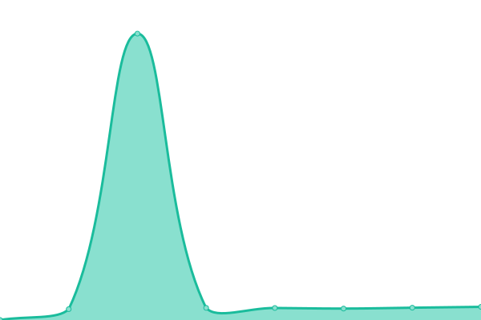
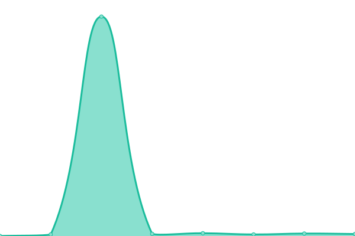
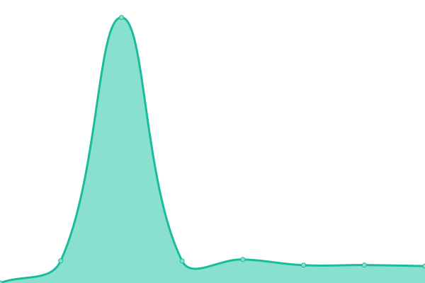

# [📈 Live Status](https://se95lopez.github.io/lighthouse-upptime): <!--live status--> **🟩 All systems operational**

This repository contains the open-source uptime monitor and status page for [Sebastian Lopez](https://se95lopez.github.io/lighthouse-upptime), powered by [Upptime](https://github.com/upptime/upptime).

With [Upptime](https://upptime.js.org), you can get your own unlimited and free uptime monitor and status page, powered entirely by a GitHub repository. We use [Issues](https://github.com/se95lopez/lighthouse-upptime/issues) as incident reports, [Actions](https://github.com/se95lopez/lighthouse-upptime/actions) as uptime monitors, and [Pages](https://se95lopez.github.io/lighthouse-upptime) for the status page.

<!--start: status pages-->
<!-- This summary is generated by Upptime (https://github.com/upptime/upptime) -->
<!-- Do not edit this manually, your changes will be overwritten -->
<!-- prettier-ignore -->
| URL | Status | History | Response Time | Uptime |
| --- | ------ | ------- | ------------- | ------ |
|  [Lighthouse RES](https://res-test-586746141603.us-central1.run.app/health) | 🟩 Up | [lighthouse-res.yml](https://github.com/se95lopez/lighthouse-uptime/commits/HEAD/history/lighthouse-res.yml) | 

 132ms
     
 | 

<a href="https://se95lopez.github.io/lighthouse-uptime/history/lighthouse-res">100.00%</a>
    

|  [Lighthouse RPS](https://rps-health-proxy-586746141603.us-central1.run.app) | 🟩 Up | [lighthouse-rps.yml](https://github.com/se95lopez/lighthouse-uptime/commits/HEAD/history/lighthouse-rps.yml) | 

 1123ms
     
 | 

<a href="https://se95lopez.github.io/lighthouse-uptime/history/lighthouse-rps">100.00%</a>
    

|  [Lighthouse Document Converter](https://documenttotext-586746141603.us-central1.run.app/dummy) | 🟩 Up | [lighthouse-document-converter.yml](https://github.com/se95lopez/lighthouse-uptime/commits/HEAD/history/lighthouse-document-converter.yml) | 

 1686ms
     
 | 

<a href="https://se95lopez.github.io/lighthouse-uptime/history/lighthouse-document-converter">100.00%</a>
    

|  [Lighthouse User Management](https://supabase-user-functions-586746141603.us-central1.run.app/health) | 🟩 Up | [lighthouse-user-management.yml](https://github.com/se95lopez/lighthouse-uptime/commits/HEAD/history/lighthouse-user-management.yml) | 

 1197ms
     
 | 

<a href="https://se95lopez.github.io/lighthouse-uptime/history/lighthouse-user-management">100.00%</a>
    

<!--end: status pages-->

[**Visit our status website →**](https://se95lopez.github.io/lighthouse-upptime)

## 📄 License

- Powered by: [Upptime](https://github.com/upptime/upptime)
- Code: [MIT](./LICENSE) © [Anand Chowdhary](https://anandchowdhary.com), supported by [Pabio](https://pabio.com)
- Data in the `./history` directory: [Open Database License](https://opendatacommons.org/licenses/odbl/1-0/)
